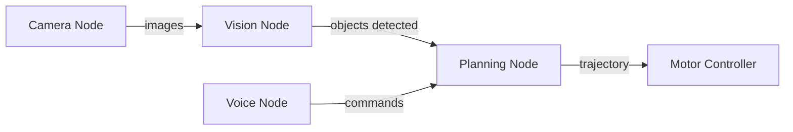

# Chapter 1: ROS 2 Architecture and Core Concepts

## Introduction

Welcome to your journey into the world of robotics middleware! **ROS 2** (Robot Operating System 2) is the backbone of modern robotic systems—from academic research robots to commercial humanoid platforms like Tesla's Optimus and Boston Dynamics' Atlas.

:::tip Learning Objectives
By the end of this chapter, you will:
- Understand the fundamental architecture of ROS 2
- Learn about the Data Distribution Service (DDS) middleware
- Master the core communication patterns
- Set up your first ROS 2 workspace
:::

## What is ROS 2?

**ROS 2** is an open-source robotics middleware framework that provides:

- 📡 **Communication Infrastructure** - Standard ways for robot components to talk
- 🛠️ **Development Tools** - Debug, visualize, and test robotic systems
- 📚 **Libraries** - Pre-built solutions for common robotics problems
- 🌐 **Community** - Thousands of packages for sensors, algorithms, and robots

### Why ROS 2 (Not ROS 1)?

ROS 2 was built from the ground up to address ROS 1's limitations:

| Feature | ROS 1 | ROS 2 |
|---------|-------|-------|
| **Real-time** | ❌ No | ✅ Yes (with DDS) |
| **Multi-robot** | ⚠️ Difficult | ✅ Native support |
| **Security** | ❌ None | ✅ DDS Security |
| **Platforms** | 🐧 Linux only | ✅ Linux, Windows, macOS|
| **Production** | ⚠️ Research | ✅ Commercial-grade |

:::info Key Difference
ROS 1 uses a **centralized master** (single point of failure). ROS 2 uses **DDS** (distributed, no master required).
:::

## ROS 2 Architecture

### The Three-Layer Model

```
┌─────────────────────────────────────────────┐
│         Application Layer (Your Code)        │
│  (Nodes, Packages, Launch Files)            │
└─────────────────────────────────────────────┘
                     ↕
┌─────────────────────────────────────────────┐
│      ROS 2 Client Library (rclcpp/rclpy)    │
│  (APIs for C++/Python)                      │
└─────────────────────────────────────────────┘
                     ↕
┌─────────────────────────────────────────────┐
│     DDS (Data Distribution Service)          │
│  (Network communication, discovery)         │
└─────────────────────────────────────────────┘
```

###1. **DDS Layer (Foundation)**

DDS (Data Distribution Service) is the communication backbone:

- **Peer-to-peer:** No central master
- **Discovery:** Nodes find each other automatically
- **QoS:** Quality of Service policies for reliability/performance
- **Real-time:** Deterministic communication

**Supported DDS Implementations:**
- Fast DDS (default)
- Cyclone DDS
- RTI Connext DDS

### 2. **ROS 2 Client Library**

Provides language-specific APIs:

- **rclcpp** - C++ client library
- **rclpy** - Python client library
- **rclnodejs** - JavaScript (experimental)

### 3. **Application Layer**

Your code! This includes:
- **Nodes** - Processes that perform computation
- **Packages** - Organizational units of ROS 2 code
- **Launch files** - Scripts to start multiple nodes

## Core Concepts

### Nodes

A **node** is a single-purpose executable that communicates via ROS 2.

**Think of nodes as:**
- Individual programs doing one thing well
- Building blocks of a robot system
- Unix philosophy: "Do one thing and do it well"

**Example nodes in a humanoid robot:**
```
Camera Node → processes camera images
Motor Controller → sends commands to motors
Planner Node → generates motion plans
Voice Recognition → converts speech to text
Decision Node → high-level robot behavior
```

### The ROS 2 Graph

Nodes form a **computational graph** connected by communication channels:



## Communication Patterns

ROS 2 provides four primary communication mechanisms:

### 1. Topics (Publish-Subscribe) 📢

**Use case:** Streaming data (sensor readings, images, positions)

- **Many-to-many** communication
- **Asynchronous** - Publishers don't wait for subscribers
- **Fire-and-forget** - No acknowledgment required

**Example:**
```python
# Publisher
import rclpy
from rclpy.node import Node
from std_msgs.msg import String

class TalkerNode(Node):
    def __init__(self):
        super().__init__('talker')
        self.publisher = self.create_publisher(String, 'chatter', 10)
        self.timer = self.create_timer(1.0, self.publish_message)
        
    def publish_message(self):
        msg = String()
        msg.data = 'Hello from Physical AI!'
        self.publisher.publish(msg)
        self.get_logger().info(f'Publishing: {msg.data}')

def main():
    rclpy.init()
    node = TalkerNode()
    rclpy.spin(node)
```

**When to use Topics:**
- Sensor data streams (IMU, camera, LiDAR)
- Robot state updates (position, velocity)
- Continuous data flow

### 2. Services (Request-Response) 🤝

**Use case:** Remote procedure calls, one-shot requests

- **One-to-one** communication
- **Synchronous** - Client waits for response
- **Reliable** - Guaranteed delivery

**Example:**
```python
# Service Server
from example_interfaces.srv import AddTwoInts

class AdditionServer(Node):
    def __init__(self):
        super().__init__('add_server')
        self.srv = self.create_service(
            AddTwoInts,
            'add_two_ints',
            self.add_callback
        )
    
    def add_callback(self, request, response):
        response.sum = request.a + request.b
        self.get_logger().info(f'{request.a} + {request.b} = {response.sum}')
        return response
```

**When to use Services:**
- Configuration changes
- Triggering specific actions
- Requests with guaranteed response

### 3. Actions (Long-Running Tasks) ⏱️

**Use case:** Goal-oriented, interruptible tasks with feedback

- **Asynchronous** goal execution
- **Feedback** during execution
- **Cancellable** - Can be preempted

**Example tasks:**
- Navigate to a position (get feedback on progress)
- Grasp an object (monitor grip force)
- Execute a motion plan (track completion percentage)

```python
# Action Server Structure
from action_msgs.msg import GoalStatus
from rclpy.action import ActionServer

class NavigationActionServer(Node):
    def __init__(self):
        super().__init__('nav_action_server')
        self._action_server = ActionServer(
            self,
            NavigateToPosition,
            'navigate',
            self.execute_callback
        )
    
    async def execute_callback(self, goal_handle):
        # Send periodic feedback
        feedback = NavigateToPosition.Feedback()
        feedback.current_position = get_current_pos()
        goal_handle.publish_feedback(feedback)
        
        # Complete the goal
        result = NavigateToPosition.Result()
        result.success = True
        return result
```

**When to use Actions:**
- Long-running operations (navigation, manipulation)
- Need progress feedback
- Must be cancellable

### 4. Parameters (Configuration) ⚙️

**Use case:** Runtime configuration without recompiling

- **Dynamic** - Can be changed while node is running
- **Typed** - String, int, double, bool, arrays
- **Declarable** - Set defaults at node creation

```python
class ConfigurableNode(Node):
    def __init__(self):
        super().__init__('configurable_node')
        
        # Declare parameters with defaults
        self.declare_parameter('max_speed', 1.0)
        self.declare_parameter('robot_name', 'humanoid_01')
        
        # Use parameters
        max_speed = self.get_parameter('max_speed').value
        robot_name = self.get_parameter('robot_name').value
        
        self.get_logger().info(f'{robot_name} max speed: {max_speed}')
```

## Setting Up Your ROS 2 Environment

### Installation

**Ubuntu 22.04 (Recommended):**

```bash
# Set locale
sudo apt update && sudo apt install locales
sudo locale-gen en_US en_US.UTF-8
sudo update-locale LC_ALL=en_US.UTF-8 LANG=en_US.UTF-8
export LANG=en_US.UTF-8

# Setup sources
sudo apt install software-properties-common
sudo add-apt-repository universe
sudo apt update && sudo apt install curl -y
sudo curl -sSL https://raw.githubusercontent.com/ros/rosdistro/master/ros.key \
    -o /usr/share/keyrings/ros-archive-keyring.gpg

echo "deb [arch=$(dpkg --print-architecture) signed-by=/usr/share/keyrings/ros-archive-keyring.gpg] http://packages.ros.org/ros2/ubuntu $(. /etc/os-release && echo $UBUNTU_CODENAME) main" \
    | sudo tee /etc/apt/sources.list.d/ros2.list > /dev/null

# Install ROS 2 Humble
sudo apt update
sudo apt install ros-humble-desktop python3-colcon-common-extensions

# Source the setup file
echo "source /opt/ros/humble/setup.bash" >> ~/.bashrc
source ~/.bashrc
```

### Verify Installation

```bash
# Check ROS 2 version
ros2 --version

# List available packages
ros2 pkg list

# Run demo talker/listener
ros2 run demo_nodes_py talker
# In another terminal:
ros2 run demo_nodes_py listener
```

## Creating Your First Workspace

A **workspace** is a directory containing ROS 2 packages.

```bash
# Create workspace
mkdir -p ~/ros2_ws/src
cd ~/ros2_ws

# Build (even if empty)
colcon build

# Source the workspace
source install/setup.bash
```

###Workspace Structure:

```
ros2_ws/
├── build/       # Intermediate build files
├── install/     # Installed packages
├── log/         # Build and test logs
└── src/         # Source code (your packages go here)
```

## Creating Your First Package

```bash
cd ~/ros2_ws/src

# Create Python package
ros2 pkg create --build-type ament_python my_robot_pkg \
    --dependencies rclpy std_msgs

# Create C++ package
ros2 pkg create --build-type ament_cmake my_robot_cpp \
    --dependencies rclcpp std_msgs
```

### Package Anatomy (Python):

```
my_robot_pkg/
├── package.xml           # Package metadata
├── setup.py             # Python setup script
├── setup.cfg            # Configuration
├── my_robot_pkg/        # Python module
│   └── __init__.py
├── resource/            # Resource files
└── test/               # Unit tests
```

## Hands-On Exercise: Hello Robot

Let's create a complete publisher-subscriber example:

### Step 1: Create the Package

```bash
cd ~/ros2_ws/src
ros2 pkg create --build-type ament_python hello_robot \
    --dependencies rclpy std_msgs
```

### Step 2: Create Publisher Node

File: `hello_robot/hello_robot/talker.py`

```python
import rclpy
from rclpy.node import Node
from std_msgs.msg import String

class HelloRobotPublisher(Node):
    def __init__(self):
        super().__init__('hello_robot_publisher')
        self.publisher_ = self.create_publisher(String, 'robot_status', 10)
        self.timer = self.create_timer(1.0, self.timer_callback)
        self.counter = 0
        
    def timer_callback(self):
        msg = String()
        msg.data = f'Robot operational. Iteration: {self.counter}'
        self.publisher_.publish(msg)
        self.get_logger().info(f'Publishing: "{msg.data}"')
        self.counter += 1

def main(args=None):
    rclpy.init(args=args)
    node = HelloRobotPublisher()
    rclpy.spin(node)
    node.destroy_node()
    rclpy.shutdown()

if __name__ == '__main__':
    main()
```

### Step 3: Create Subscriber Node

File: `hello_robot/hello_robot/listener.py`

```python
import rclpy
from rclpy.node import Node
from std_msgs.msg import String

class HelloRobotSubscriber(Node):
    def __init__(self):
        super().__init__('hello_robot_subscriber')
        self.subscription = self.create_subscription(
            String,
            'robot_status',
            self.listener_callback,
            10
        )
        
    def listener_callback(self, msg):
        self.get_logger().info(f'Received: "{msg.data}"')

def main(args=None):
    rclpy.init(args=args)
    node = HelloRobotSubscriber()
    rclpy.spin(node)
    rclcpp.shutdown()

if __name__ == '__main__':
    main()
```

### Step 4: Update setup.py

```python
entry_points={
    'console_scripts': [
        'talker = hello_robot.talker:main',
        'listener = hello_robot.listener:main',
    ],
},
```

### Step 5: Build and Run

```bash
cd ~/ros2_ws
colcon build --packages-select hello_robot
source install/setup.bash

# Terminal 1
ros2 run hello_robot talker

# Terminal 2
ros2 run hello_robot listener
```

## ROS 2 Command-Line Tools

### Introspection Tools

```bash
# List all nodes
ros2 node list

# Node information
ros2 node info /hello_robot_publisher

# List topics
ros2 topic list

# Topic information
ros2 topic info /robot_status

# Echo topic messages
ros2 topic echo /robot_status

# Publish from command line
ros2 topic pub /robot_status std_msgs/msg/String "data: 'Manual command'"

# Service list
ros2 service list

# Service call
ros2 service call /add_two_ints example_interfaces/srv/AddTwoInts "{a: 5, b: 3}"
```

## Quality of Service (QoS)

QoS policies control communication behavior:

```python
from rclpy.qos import QoSProfile, ReliabilityPolicy, HistoryPolicy

# Sensor data: fast, but can drop messages
sensor_qos = QoSProfile(
    reliability=ReliabilityPolicy.BEST_EFFORT,
    history=HistoryPolicy.KEEP_LAST,
    depth=10
)

# Commands: must be reliable
command_qos = QoSProfile(
    reliability=ReliabilityPolicy.RELIABLE,
    history=HistoryPolicy.KEEP_ALL
)

# Create publisher with QoS
self.publisher = self.create_publisher(String, '/topic', sensor_qos)
```

## Best Practices

### 1. Node Design
✅ **Do:**
- One node, one purpose
- Small, focused nodes
- Descriptive node names

❌ **Don't:**
- Monolithic "god" nodes
- Stateful dependencies between nodes

### 2. Topic Naming
✅ **Do:**
- Use descriptive names: `/camera/front/image_raw`
- Namespace by robot: `/robot1/sensors/lidar`

❌ **Don't:**
- Generic names: `/data`, `/status`
- Inconsistent naming conventions

### 3. Error Handling
```python
def safe_callback(self, msg):
    try:
        # Process message
        result = self.process(msg)
    except Exception as e:
        self.get_logger().error(f'Processing failed: {e}')
        return
    
    # Publish result
    self.publisher.publish(result)
```

## Summary

In this chapter, you learned:

✅ What ROS 2 is and why it's essential for robotics  
✅ The three-layer architecture (DDS, Client Library, Application)  
✅ Core communication patterns (Topics, Services, Actions, Parameters)  
✅ How to set up a ROS 2 workspace  
✅ How to create and build packages  
✅ Command-line tools for introspection  

## Practice Exercises

1. **Basic Communication**
   - Create a temperature sensor node (publisher)
   - Create a temperature monitor node (subscriber)
   - Publish temperature readings every second

2. **Service Implementation**
   - Create a service that calculates robot speed given distance and time
   - Test with command-line tool

3. **Exploration**
   - Use `ros2 topic echo` to view messages
   - Use `ros2 node info` to inspect node connections

## Additional Resources

- [ROS 2 Documentation](https://docs.ros.org/en/humble/)
- [ROS 2 Tutorials](https://docs.ros.org/en/humble/Tutorials.html)
- [DDS Specification](https://www.omg.org/spec/DDS/)

## Next Chapter

Ready to dive deeper? In **Chapter 2**, we'll explore:
- Nodes in detail
- Creating custom messages
- Lifecycle management
- Advanced topics and message filtering

👉 [Continue to Chapter 2: Nodes, Topics, and Services →](./chapter-2.md)

---

:::tip Checkpoint
Before moving on, ensure you can:
- Explain the difference between ROS 1 and ROS 2
- Create a simple publisher and subscriber
- Use ros2 command-line tools
- Build a ROS 2 workspace
:::
